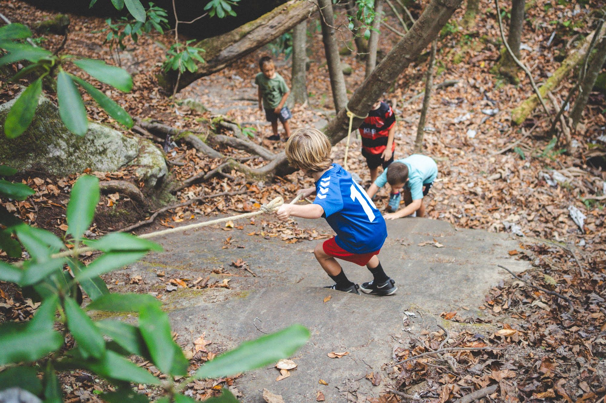
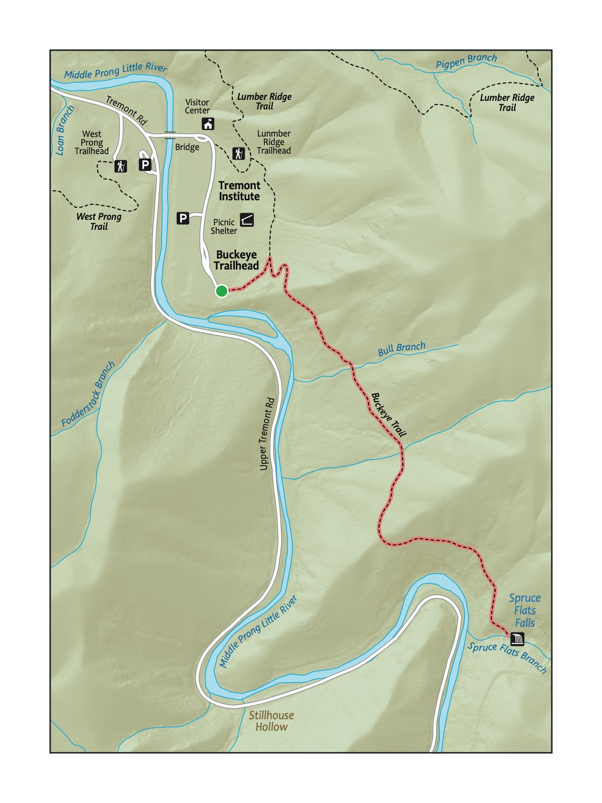
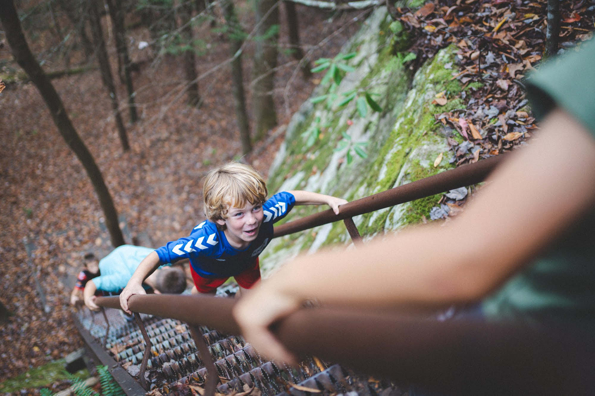

## Trail 19: Honey Creek

**Figures included in this chapter:**

- trail-20-figure-01.jpg
- trail-20-map.jpeg
- jo-bsf-cliff.jpg
- honey creek sign.jpg
- jonah ladder honey creek.jpg

### Overview

This hike is unreal! This trail features rope ladders, wooden ladders, gigantic sandstone walls, a scenic overlook, a trail that traverses *up* a river, and boulders you crawl over and through. It's spectacular and challenging. This is a memorable trail that exemplifies what makes the Cumberland Plateau region such a worthy complement to the Great Smoky Mountains National Park. Younger children may be able to hike the first half (traveling counterclockwise from the trailhead); you can walk the road back to the trailhead. The second half of the trail contains more challenging (but very beautiful) sections. Still, it's hard – probably the most difficult for most in this book, making it best for the older kiddo hiker. Oh, and you will definitely want to be prepared to get your feet wet on this hike!

### Key Characteristics

| **Characteristic**        | **Details**                      |
|---------------------------|----------------------------------|
| Time from Knoxville | 1 hr 30 mins             |
| Trail Distance (Miles)    | 4.4                              |
| Elevation Change          | Steep                            |
| Pets                      | Not Allowed                      |
| Parking Pass/Entrance Fee | Required                         |
| Restroom(s)               | No                               |
| Best Ages                 | Big kids and Pre-teens and older |
| Accessibility             | Not accessible                   |

### Directions to the Trailhead

Trailhead Address: Honey Creek Trailhead and Parking Area, C8CX+G7 Allardt, Tennessee

Trailhead GPS Coordinates: 36.42123, -84.65180

Navigate to the Honey Creek Trailhead. Note that there is also a Honey Creek Overlook, which is the incorrect start for this hike. The above address uses a Google Maps "Plus" code in lieu of a street address for this trailhead; it only works in Google Maps.

Park in one of the many spots at the trailhead. The trail begins slightly past the trailhead, on the other side of the road from the large signpost for the trailhead, slightly up the road. Look for the Honey Creek Loop Trail sign.

### Trail Description

| Distance from Start | Description                                                                                                                                                                                            |
|:---------------|:-------------------------------------------------------|
| 0.0                 | Start on the Honey Creek Loop Trail. Gently wind through the densely wooded forest.                                                                                                                    |
| 0.2                 | Gently, then more steeply, descend through the woods.                                                                                                                                                  |
| 0.9                 | Rope ladder.                                                                                                                                                                                           |
| 1.05                | Enter the section with high cliff walls along the left of the trail.                                                                                                                                   |
| 1.35                | Trail splits to the left to head to the overlook. Ladders.                                                                                                                                             |
| 1.45                | Overlook. After stopping at the overlook, head back down to resume the trail by turning left at the trail juncture. Or, optionally, walk the road back 0.8 miles to the parking area and trailhead.    |
| 1.75                | Trail turns up into Honey Creek. Look for the green symbol with two hikers as a guide to follow the trail; in places, you'll walk through the creek and through crevices and cracks in giant boulders! |
| 2.25                | Head up and away from the creek.                                                                                                                                                                       |
| 2.75                | Wind through and around huge boulders and rocks. Continue to look for the green trail symbols.                                                                                                         |
| 3.0                 | Ice Castle Falls, a beautiful waterfall.                                                                                                                                                               |
| 3.1                 | Gentle climb through a rocky, exposed section with different vegetation.                                                                                                                               |
| 3.25                | Short rope ladder.                                                                                                                                                                                     |
| 3.3                 | Trail levels out, then climbs back to the start and the trailhead.                                                                                                                                     |
| 4.4                 | Trailhead.                                                                                                                                                                                             |

::: {.callout-note appearance="simple" icon="true"}
#### Sandstone

The Cumberland Plateau's sandstone cliffs tell their age in layers—tan and gray rock streaked with rust-orange where ancient iron has slowly rusted over millions of years. Water and time have carved dramatic overhangs called rockhouses, creating natural shelters that kids can't resist exploring. At Honey Creek, these bluffs tower overhead at nearly every turn.

<!-- Media: photo -->
:::

### Nearby

-   **Grab a slushie!** This is one of the most remote—if not the most remote—hikes in this book. A favorite stop on the way back from Honey Creek is to quench our thirst by enjoying a slushie at the Pilot Travel Center (106 Comfort Ln, Pioneer, TN 37847) off exit 122 on I-75.
