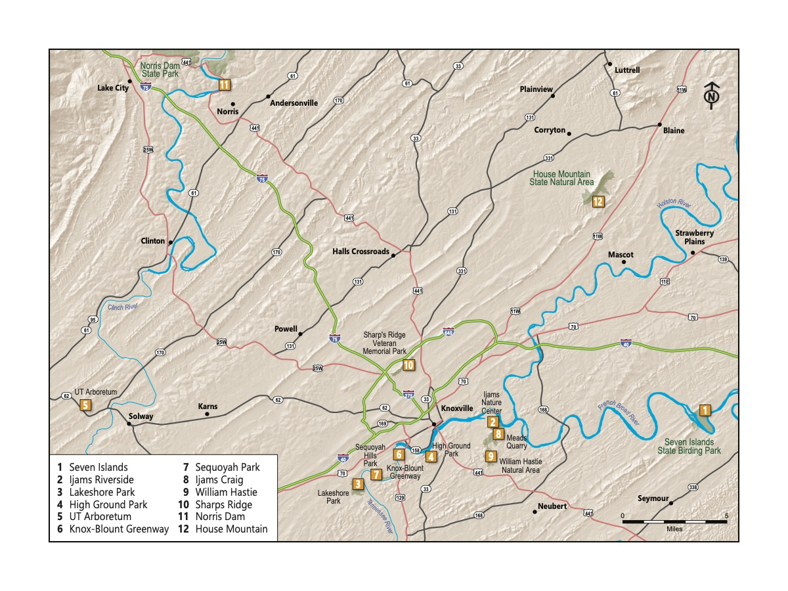
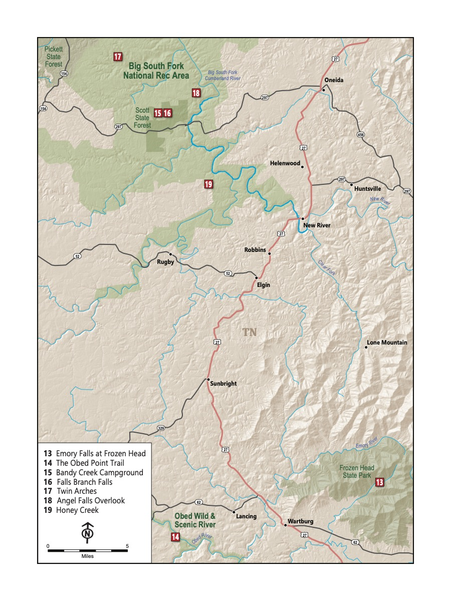
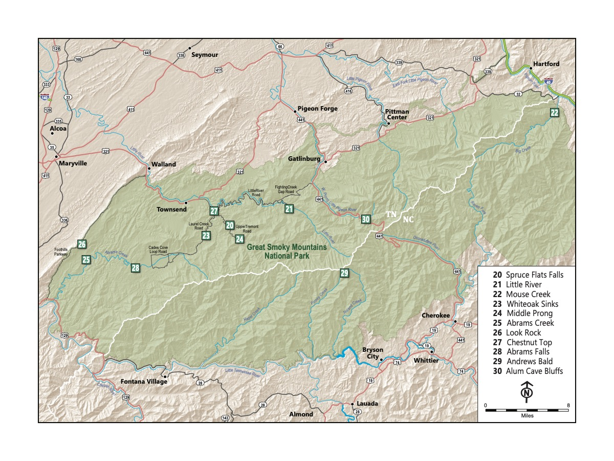

::: {.lead}
**30 family-friendly hiking trails across the Tennessee Valley, Cumberland Plateau, and Great Smoky Mountains National Park** — selected for scenery, driving distance, and kid-friendly terrain.
:::

*Coming in 2026 from [University of Tennessee Press](https://utpress.org)*

---

## About the Book

Picture this: a sunny day in nature with your family. Your kids happily climb up and over rocks, stopping only to splash in creeks. At the end, you have a picnic on a perfect, mild, warm day without a bug to be found.

*Record Scratch.*

Sure, we'd all love that vision to be reality — but the truth is almost always a bit messier. If you're like us, you might be ready to throw in the towel before you even leave home. We've been there.

But we've also grown as a family who hikes, honed the process, and adjusted our expectations. And sometimes the weather is just right, the kiddos are having a great time, and, every once in a while, there really isn't a bug in sight.

After moving to Knoxville as a very young family in 2018, our first trip to Ijams introduced us to Knoxville's incredible outdoor spaces. A camping trip at Frozen Head opened our eyes. Later, visiting the Smokies sealed the deal: hiking helped us feel connected to — and eventually love — where we live.

As we became more established in Knoxville, our friends kept asking us the same questions:

> *Where should we hike with our kids? And what do we need?*

This book is our answer. We picked 30 trails with an eye not only toward scenic and exciting destinations, but also those that balance driving distance, crowds, and kid-friendly characteristics. One of the best things about hiking is that you don't need much to get started — indeed, you may not need anything at all.

---

## 30 Trails Across Three Regions

::: {layout-ncol=3}

:::

The 30 trails range from paved, stroller-accessible paths under a mile to full-day adventures in the Smokies. Every chapter includes a trail map, mile-by-mile description, key characteristics (distance, elevation, pet policy, accessibility), and suggestions for what to do nearby.

[Read a sample chapter: Seven Islands State Birding Park →](Trail_1__Seven_Islands.qmd)

---

## Finding Your Perfect Hike

Whether you're heading out with a baby in a carrier or a ten-year-old ready for a challenge, there's a trail for you.

::: {layout-ncol=3}
::: {.card .p-3}
**For Babies and Infants**

*Short distances and paved paths*

1. High Ground Park
2. Knox-Blount Greenway
3. Lakeshore Park
4. UT Arboretum
5. Norris Dam
:::

::: {.card .p-3}
**For Kids Who Love Water**

*Splash-friendly trails for warm weather*

1. Middle Prong
2. Abrams Creek
3. Spruce Flats Falls
4. Honey Creek
5. Mouse Creek
:::

::: {.card .p-3}
**Bigger Adventures**

*More challenge for kids who are ready*

1. Alum Cave
2. Andrews Bald
3. Honey Creek
4. Little River
5. Abrams Falls
:::
:::

---

## About the Authors

**Katie Rosenberg** is a parent and school librarian at L&N STEM Academy in Knoxville, TN.

**Joshua Rosenberg** is a parent and a faculty member in the College of Education, Health, and Human Sciences at the University of Tennessee, Knoxville.

Together they have hiked all 30 trails in this book with their two children.

[More about the authors →](about.qmd)

---

## Coming in 2026

*Little Kids, Big Adventures* will be published by the **University of Tennessee Press** in 2026. More information on where to purchase the book will be available here soon.
